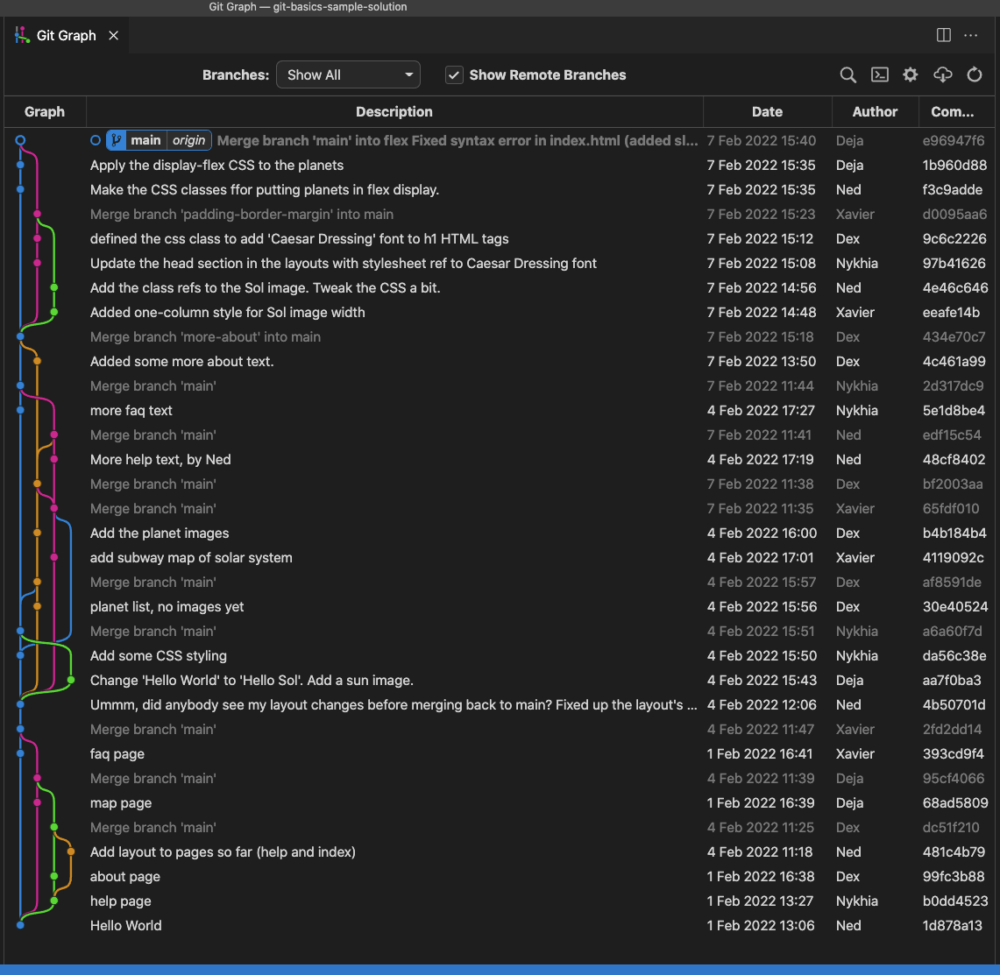

# Prework for the Git Basics Course

This course assumes you have ...
1. A [GitHub](https://github.com) account.
1. Visual Studio Code installed.
1. Access to some sort of bash shell: On MacOSX, Terminal.app; on Windows, it would be [Windows Subsystem for Linux](https://learn.microsoft.com/en-us/windows/wsl/install) or [Git For Windows](https://gitforwindows.org/).


This prework should only take a few minutes. You'll do  a little git environment setup, install the Git Graph plugin, and familiarize yourself with Git Graph by examining a sample repo for a hypothetical project team.


## Run these commands in your Terminal.app or Git bash
```bash
git config --global pull.rebase false  # Tell git what to do when pulling
git config --global core.editor "code --wait"  # Set git editor to vscode
cd                          # Start from your home directory
mkdir -p src
cd src                      # Or cd to wherever you keep code projects

# Although you won't be committing anything to it, 
# you'll use this sample repo as a reference...
#
git clone https://github.com/walquis/git-basics-sample-project-repo
cd git-basics-sample-project-repo
```

## Install the GitGraph plugin in your VSCode

Visit the [GitGraph Plugin Install](https://marketplace.visualstudio.com/items?itemName=mhutchie.git-graph) page and follow the install instructions.

## Explore the sample repo's code and history
This repo records the work of a five-member team: Ned, Nykhia, Dex, Deja, and Xavier.

Open `index.html` to view the website in the [git-basics-sample-project-repo](https://github.com/walquis/git-basics-sample-project-repo) that you cloned:  Choose "File --> Open File..." in your browser, navigate to `index.html` and open it.  You should see something like this...


(You could also view it with a [Live Server](https://marketplace.visualstudio.com/items?itemName=ritwickdey.LiveServer) extension in VSCode).

Point VSCode at the `git-basics-sample-project-repo` directory, and look at the history with GitGraph:




### Some questions the commit graph can help answer

1. What is the name of the branch to which changes have been delivered?
1. Who added the planet images?
1. Are there any changes in the repo that have not yet been delivered?
1. **Challenge Question** - Why was Ned grumpy in his comment on 4 Feb 2022 12:06, commit 4b50701d? What did his teammates miss when they merged?

### Explore the code at a specific commit
**Hint**: You can do a 'detached head' checkout, that is, where HEAD points to a commit rather than a branch name.  It's handy for viewing the repo at chosen points in history.  For instance, you can open the website in its state as-of a specific commit.  Or run the repo's tests (if the repo had tests defined).

What should Xavier have done during his merge to make Ned happy?  Who else should have done the same?

```
$ git checkout 393cd9f4   # Xavier's merge, before Ned fixed things up.
$ open index.html         # Explore the website at this point in history.
$ git checkout 4b50701d   # Ned's fixes
$ git checkout main       # Set HEAD back to a branch reference (`main` in this case).
```

## What's Next?

Take a look at the [syllabus](syllabus.md).

In class, you and your team will be making changes in parallel that may resemble this sample history, as you experience what collaboration looks like with git.

Explore some [Unix/Shell Concepts](unix-shell-concepts.md). I *may* touch on these briefly in class. Feel free to google around on your own; focus on bash shell concepts, especially I/O redirection, process hierarchy and management, and environment variables.

If you want to go deep before class starts, [Reset Demystified](https://git-scm.com/book/en/v2/Git-Tools-Reset-Demystified) will give you a head-start on some of the core class material.
