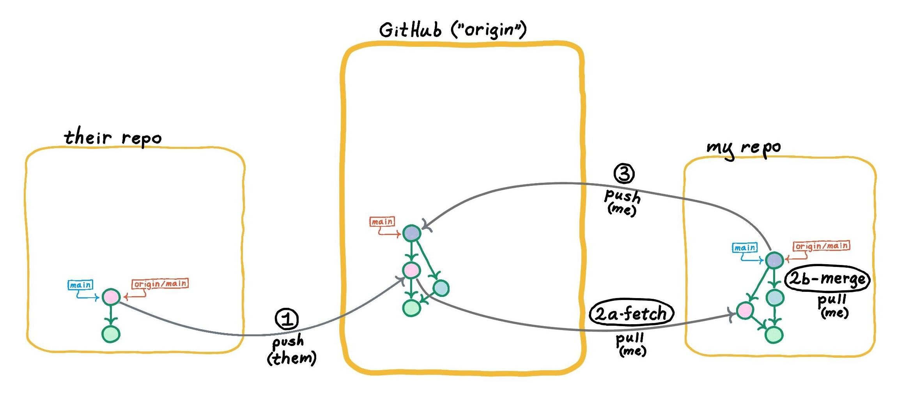
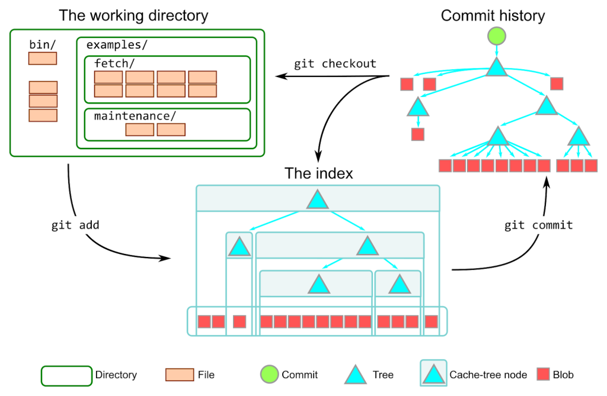

## Session One

### Setup
1. Has everyone done the [Prework](prework.md)?
1. Open your Linux shell.
1. Define your project teams.
1. **Team**: Choose a team lead.
1. **Team Lead**: Fork the starter repo.  Choose a name for it: `solar-system`, for example.
1. **Team Lead**: Invite your team as collaborators to `solar-system`.
1. **Whole Team, including Team Lead**: Clone team lead's repo (do NOT fork it!).
1. Run these commands to set up some handy aliases...
```bash
cd solar-system/bin
source git-aliases.sh
adog
```

✅ **Checkpoint: Everyone has their team lead's repo cloned (including the team lead)**.

✅ **Checkpoint: Everyone has their aliases working. (Check by running `adog` as shown above).**

### The Simplest Possible Collaborative Git Workflow
"Simple" is everybody working on the `main` branch...pretty simple, but not the best!

**Vocabulary**: remote, merge commit, "fast-forward merge"

**Commands**: `git pull`, `git add`, `git commit`, `git push`, `git fetch`, `git merge`

A basic workflow in the ["shared-repository model"](https://docs.github.com/en/pull-requests/collaborating-with-pull-requests/getting-started/about-collaborative-development-models) of development:


Click [here](./session1/simple-workflow.md) for a walk-through of this workflow.

🤔 What is the difference between a merge commit, and a commit that has a merge conflict?

#### LAB - Simplest Possible Collaborative Git Workflow
> 1. **Each teammate**: Commit and push at least one _non-conflicting_ change.  For instance, each teammate
> can modify one of these files: `index.html`, `help.html`, `about.html`, `faq.html`, `map.html`.
> 1. `git push` and `git pull` until all of you have each other's changes and are on the same commit locally.

✅ **Checkpoint: Your team is all on the same commit. (Check by running `adog` and observing which commit HEAD is on).**

### Anatomy of a Git Commit, or, "The Three Objects"

**Vocabulary**: sha, content-addressable, blob, tree, commit

**Commands**:
- `git show` - What's in the latest commit.  See [Viewing Repo Changes](./viewing-changes.md) for more.
- `git reflog` - local history of where HEAD has been.
- `git cat-file -p` - just for teaching purposes; not part of a normal git workflow

Now that we have some commits, let's take a closer look...


🤔 Is it possible for a commit to have the same SHA as its parent?

#### LAB - Anatomy of a Git Commit, or, The Three Objects
> Use `git cat-file -p` to answer these questions:
> 1. What fields does HEAD have?
> 1. What kind of SHA is HEAD's "parent" field? (Use `-t` instead of `-p`)
> 1. What fields does HEAD's tree have?
> 1. What are the contents of HEAD's tree's first blob?

### Your Local Git repo and The Three Trees - or, "Intro to `git reset`"
We'll learn to use `git reset` to move changes back and forth between the "three trees" - **working tree**, **index**, and **HEAD**.  For more in-depth, work thru [The Objects and Trees Exercise](objects-and-trees-exercise.md).

**Vocabulary**:
- working tree, index, HEAD
- "detached HEAD" state

**Commands**: `git diff`, `git diff --staged`, `git reflog`, `git stash`

When I last checked (end of March 2023), six of the [top twelve stackoverflow questions](https://stackoverflow.com/questions?tab=Votes) were git questions!!  For at least a couple of those, the answer is `git reset`.

A busy diagram--it shows the objects as well as the trees--but worth pondering ...


#### LAB - Commit changes and then modify them with `git reset`
Use each of `git reset`'s `--soft`, `--mixed`, and `--hard` options at least once.
> 1. Make a change and commit it (do not `git push`!).
> 1. Undo the change using `git reset`.
> 1. Make another change, and commit.
> 1. Revert, using another option of `git reset`.  Commit.
> 1. Revert, using another option of `git reset`.  Commit.

🤔 So far, we've only used `git reset` to move our current branch back one commit.  But with `git reset`, we can move our current branch anywhere we want.  When might this be useful?

**Scenario**: You accidentally make commits on `main`, but then realize you should be on a different branch--for instance, in order to push that branch and submit a Pull Request for it (we'll discuss PR's soon).

#### LAB - Simulate branching "after-the-fact"
> 1. Make 3 or 4 commits on `main`.  Then realize Oops, I should be on another branch.
> 1. Make a branch at your current location.  _Hover [here](doesnotexist.jpg, "'git branch mybranch' (not 'git checkout mybranch'!  Why is that?)") for a hint._
> 1. Use `git reset` to move `main` back to where it should be.

### Create And Resolve Merge Conflicts - With Basic Workflow

#### LAB - merge conflicts
> 1. Each teammate: Change the same line in same file (e.g. Change "The Solar System" in `index.html` to some other text).
> 1. Commit.
> 1. One teammate do a `git push`; the others `git pull`.
> 1. Among your team, resolve merge conflicts and `git push` until you all have the same commit sha for HEAD.

### Create And Resolve Merge Conflicts - Using Branches and PR's
Github supports [two collaborative development models](https://docs.github.com/en/pull-requests/collaborating-with-pull-requests/getting-started/about-collaborative-development-models):
- fork and pull
- shared repository <--- This is us

>>"In the shared repository model, collaborators are granted push access to a single shared repository and topic branches are created when changes need to be made. Pull requests (PR's) are useful in this model as they initiate code review and general discussion about a set of changes before the changes are merged into the main development branch. This model is more prevalent with small teams and organizations collaborating on private projects."

We'll be working with the shared repository model.

🤔 Why is it called a "**Pull** Request", if you're **pushing** changes?

#### LAB - Create/Handle merge conflicts again - but now using Pull Requests in your workflow
> 1. Each teammate: `git checkout -b` _yourOwnBranchName_
> 1. Each teammate: Change the same line in same file, like before.
> 1. Commit.
> 1. `git push` _yourOwnBranchName_
> 1. Go to Github and make a PR for your branch; choose one or more reviewers.
> 1. Reviewers: review/approve the PRs and merge.
> 1. Review and merge, `git pull`, etc. until you all have the same commit sha for HEAD.


