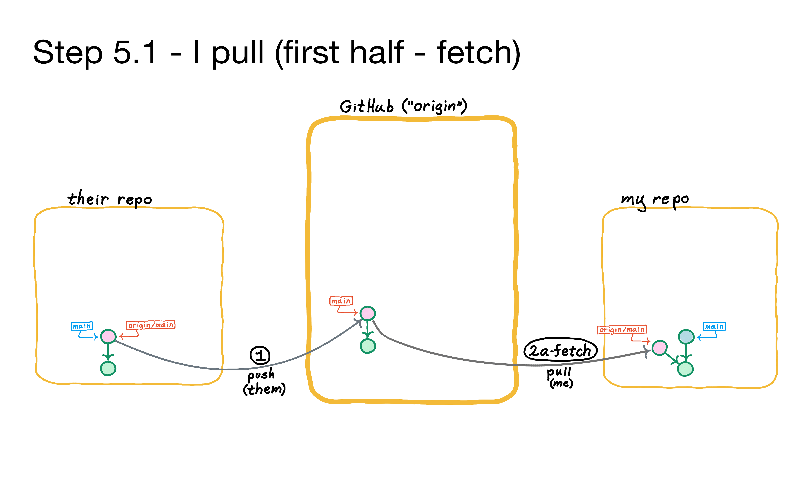

I now pull, by running something like this to see if there are changes to integrate (as indeed there are in this case):
```
$ git pull origin main
```

### Key Points:
- **A `git pull` is a two-part operation**[^gitpushmirror].  The first part, shown above, is called "fetch", and brings into my repo's DB any commits from the remote that belong to the requested branch and are not already here.
- The second part is "merge", which updates my local branch with those changes.
- Essentially, a `git pull` combines these two commands:
```
$ git fetch origin main  # Grab commits associated with current branch, and update tracking branch
$ git merge origin/main  # Merge into my current branch from the (now-up-to-date) tracking branch
```
I can run these explicitly, instead of a `git pull`; perhaps I want to see what's happened on the remote before I integrate those changes, so I might `git fetch` and take a look before doing a `git merge`.

---
[^gitpushmirror]: As mentioned earlier, `git pull` is conceptually a mirror image of `git push`.
